# Social Fun

This project is designed and developed to create a better user experience for the users / members of a community. The users has the ability to register and login to the site and view the events posted by the admin / community responsible person. The users are also able to register to events, like and comment on an event, edit and delete their comments. The functionality of category & profile pages and search bar are also added for user convenience and better user experience.

The website is created for real-life situations but embedded with fictitious data for checking purpose. The site is showcasing Python (Django framework), JavaScript, HTML, CSS, Bootstrap, PostgreSQL database, Herokuapp and Gitpod for Project Portfolio 4.

And can be accessed by this [link.](https://socialfun-9d543c215b26.herokuapp.com/)

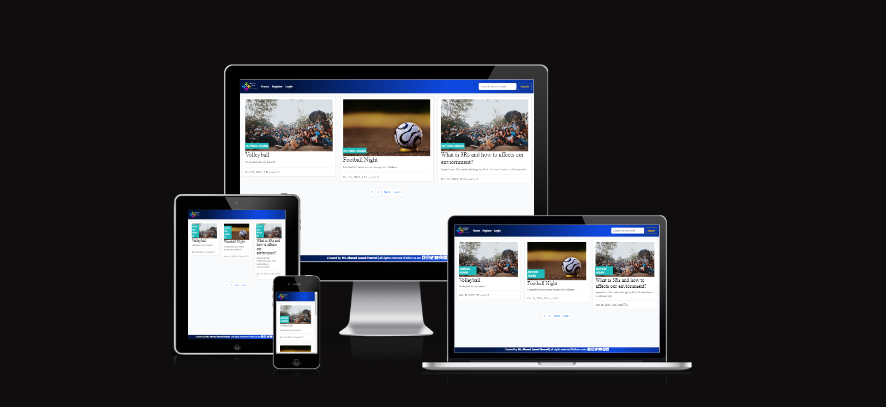

## Contents
<a name="contents"></a>

- [UX](#ux)
  - [Strategy](#strategy)
    - [User Stories](#user-stories)
  - [Scope](#scope)
    - [Simple and intuitive User Experience](#simple-and-intuitive-user-experience)
    - [Relevant content](#relevant-content)
    - [Features for upgraded experience](#features-for-upgraded-experience)
    - [Different account types for Participants and staff members or Admin](#different-account-types-for-participants-and-staff-members-or-admin)
    - [Responsiveness](#responsiveness)
  - [Structure](#structure)
  - [Skeleton](#structure)
    - [Wireframes](#wireframes)
    - [Database](#database)
  - [Surface(Design)](#surface-design)
    - [Color Scheme](#color-scheme)
    - [Imagery](#imagery)
    - [Typography](#typography)
- [Agile Methodology](#agile-methodology)
- [Features](#features)
  - [Existing Features](#existing-features)
  - [Features Left to Implement](#features-left-to-implement)
- [Technologies Used](#technologies-used)
  - [Languages Used](#languages-used)
  - [Python Packages](#python-packages)
  - [Programs Used](#programs-used)
- [Testing](#testing)
  - [Development Testing](#development-testing)
  - [Testing User Stories](#testing-user-stories)
     - [User Goals](#user-goals)
     - [Site Administrator Goals](#site-administrator-goals)
  - [Validator Testing](#validator-testing)
  - [Bugs / Issues](#bugs--issues)
  - [Unresolved Bugs / Issues](#unresolved-bugs-or-issues)
- [Deployment](#deployment)
  - [Deploying to Heroku](#deploying-to-heroku)
  - [Fork the repository](#fork-the-repository)
  - [Making a Local Clone](#making-a-local-clone)
- [Credits](#credits)
  - [Content](#content)
  - [Media](#media)
  - [Code](#code)
- [Acknowledgements](#Acknowledgements)


## UX
### Strategy
The objective of the site is to provide a common platform for all user to view and register to community events. The site allows users to share their thoughts, leave comments through commenting and liking/unliking events. 
#### User Stories
- User Goals:
  - As a Site User I can find the navigation items so that I can navigate the site easily.
  - As a Site User I can view a paginated list of events so that I select an event to view.
  - As a Site User I can view a list of events so that I can select one to check for more details.
  - As a Site User I can click on an event so that I can read the full content.
  - As a Site User / Admin I can view the number of likes on each event so that I can see which is the most popular or viral.
  - As a Site User / Admin I can view the number of participants on each event so that I can view how many people have registered for the event.
  - As a Site User I can register an account so that I can comment, like and participate to events.
  - As a Site User I can login & logout of the site so that I can access the site securely.
  - As a Site User / Admin I can view comments on an individual event so that I can read the conversation.
  - As a Site User I can leave comments on an event so that I can be involved in the conversation.
  - As a Site User I can edit and delete my comments so that I revise/update and remove the contents.
  - As a Site User I can like or unlike an event so that I can interact with the content.
  - As a Site User I can register to an event so that I can participate.
  - As a Site User I can click on the event category so that I can view the events for selected category.
  - As a Site Admin I can create, edit, update and delete event categories so that I can manage the event categories.
  - As a Site User I can search for desired event so that I can find it more easily and quickly.
  - As a Site User I can view my profile so that I can check and update it.
  - As a Site User I can edit my profile so that I can keep it up-to-date.
  - As a Site User I can upload a profile picture so that my profile looks good and modern.
  - As a Site User I can receive different alert messages so that I know the status of different actions happened.
<br>

- Site Administrator Goals:
  - As a Site Admin I can create, read, update and delete events so that I can manage the event content.
  - As a Site Admin I can create draft events so that I can finish writing the content later.
  - As a Site Admin I can approve or disapprove comments so that I can filter out objectionable comments.
  - To handle any potential errors appropriately and consistently.
  - To keep security sensitive information hidden.

### Scope
#### Simple and intuitive User Experience
 - Ensure the site title and logo provides the first hand information regarding the site;
 - Ensure the navigation menu is visible and functional at every step;
 - Ensure every page has a suggestive name that fits the its content;
 - Ensure the user will get visual feedback when navigating through pages;
 - Ensure the design matches the events theme and does not confuse the user.

 #### Relevant content
 - Add information about event such as name, category, venue, description, author, participants, created_on, start_date, end_date, registeration_deadline and status;
 - Create relevant navigation buttons for each section;
 - Create a section for comments, category and profile.

#### Features for upgraded experience
- Create a paginated list of events that allows user to view all events along with all its details;
- Create an event detail page that allows user to like/unlike the event, register to an event, leave, edit and delete comments;
- Create a category page with dropdown options that allows user to view all events related to selected category;
- Create a profile page that allows user to view and edit his profile. The user can also view that how many events it has created and registered to;
- The search bar in the navigation area gives the user the ability to search for events quickly and easily.

#### Different account types for Participants and staff members or Admin
- Participants can register to events while the admin can add event, category and approve comments;
- Participants can like/unlike and leave comments on events; edit and delete their comments but the comments will be approved by the admin and will be published;
- Participants have access only to their Profile page for managing it;
- Staff members/ admin has access to admin panel to manage events, comments, category and both types of accounts.

#### Responsiveness
- Create a responsive design for desktop, tablet and mobile devices.

### Structure
The structure of the website is divided into nine pages but the content is depending on authentication and authorization of users.
- **Register/Login** pages give the user the possibility to create an account and authenticate for accessing different features;
- **Logout** feature is a modal that helps user to exit the site securely;
- **Home** page is open and visible to all types of user irrespective of registeration and authorization and includes list of all events;
- **Event Detail** page is visible only to logged-in user and displays the detail of selected event. The page also allows user to like/unlike and register to an event. The user also has the ability to leave, edit and delete comments related to the event;
- **Registeration Confirmation** page is visible only to logged-in user and allows the user to complete the event registeration process.
- **Event Category** page is visible only to logged-in user and allows the user to view the list of events for a selected category.
- **Profile** page is visible only to logged-in user and allows the user to view and update its contents.
- **Search Bar** feature is visible to all users and allows the user to search for matching events based on the typed characters. But the actual link to display the details of the event is only visible to logged-in user.
- **Admin Panel** page is visible only to staff members with admin rights / admin to manage the events, comments, category, profile and user accounts.

### Skeleton

#### Wireframes
Wireframe is used to plan and sketch the website.

##### Mobile Devices
- [Home Page. Mobile Screen](/static/media/home_page_mobile.png)
- [Event Detail Page. Mobile Screen](/static/media/event_detail_page_mobile.png)
- [Event Registeration Confirmation Page. Mobile Screen](/static/media/registeration_confirmation_mobile.png)
- [Category Page. Mobile Screen](/static/media/category_page_mobile.png)
- [Profile Page. Mobile Screen](/static/media/profile_page_mobile.png)
- [Sign Up Page. Mobile Screen](/static/media/signup_page_mobile.png)
- [Login Page. Mobile Screen](/static/media/login_page_mobile.png)
- [Logout Page. Mobile Screen](/static/media/logout_page_mobile.png)

##### Desktop 
- [Home Page. Desktop Screen](/static/media/home_page_desktop.png)
- [Event Detail Page. Desktop Screen](/static/media/event_detail_page_desktop.png)
- [Event Registeration Confirmation Page. Desktop Screen](/static/media/registeration_confirmation_desktop.png)
- [Category Page. Desktop Screen](/static/media/category_page_desktop.png)
- [Profile Page. Desktop Screen](/static/media/profile_page_desktop.png)
- [Sign Up Page. Desktop Screen](/static/media/signup_page_desktop.png)
- [Login Page. Desktop Screen](/static/media/login_page_desktop.png)
- [Logout Page. Desktop Screen](/static/media/logout_page_desktop.png)

#### Database
PostgreSQL relational database is used to store the website data. 
<details>
  <summary>Database Schema</summary>
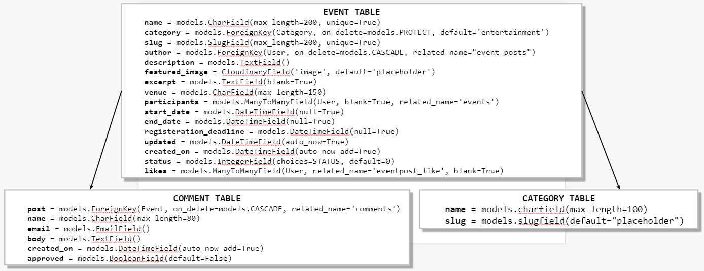<br>
</details>

### Surface (Design)
#### Color Scheme
All colors were selected with the eyedropper plugin from the website logo to maintain chromatic harmony.
- Radial-gradient (circle at 74.2% 50.9%, rgb(14, 72, 222) 5.2%, rgb(3, 22, 65) 75.3%) is used as the main color for the header and footer sections.<br>

- (#E84610) color is used as hover and active color for header and footer sections. The color is also used for delete buttons and links.<br>
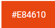
- (#0D6EFD) is used as text color for event heading and description, for buttons except indicated separately, and for image flash.<br>
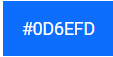
- (#000) is used as the text color for event-subtitle.<br>
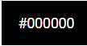
- (#F6F6F6) is used as the main background color.<br>
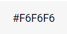
- (#FFF) is used as the main text color for the header and footer sections, event titles and buttons' text color.<br>
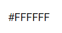
- Few other limited colors are used as border and shading colors.

#### Imagery
- The website logo that describes the website's purpose is taken from [Freepik](https://www.freepik.com/).
- The fictitious pictures used in the website are taken from [Pexcels](https://www.pexcels.com/).

#### Typography
- EB Garamond font is used as the main font for headings.<br>
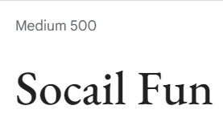
- Roboto font is used as the main font for paragraphs.<br>
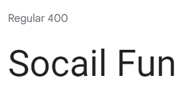
<br><br>
<a href="#contents">BACK TO CONTENTS 🔼</a>

## Agile Methodology
This project was developed using the Agile methodology.
All user stories implementation progress was registered using socialfun_project. As the user stories were accomplished, they were moved from the board **To Do**, to **Progress** and finally **Done** lists.

## Features 

### Existing Features

- __Home Page__ 
  - When the website loads, the home page will loads as well as default page to all users wheather authenticated or not. 
  - The home page is paginated and contains list of all events published by the authorized community user / admin. 
  - The event's name, author, excerpt, image, date created on and number of likes are displayed in the home page. 
  - If the user is authenticated then the event name and excerpt will be an active navigate link to the event detail page. 
  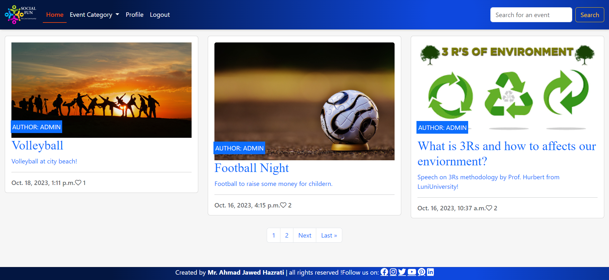<br><br>
- __Event Detail Page__ 
  - This page is only visible to authorized user and contains all details of the event. 
  - The page also contains the event registeration link and comment sections. 
  - The registeration button is visible in case the user has not yet registered to the event, otherwise, registeration confirmation message will be displayed.
  - The user can leave, read, edit and delete comments. 
  - The comments will be visible to other users once has been approved and published by the admin but can be seen, edited and deleted by the comments' owner.
  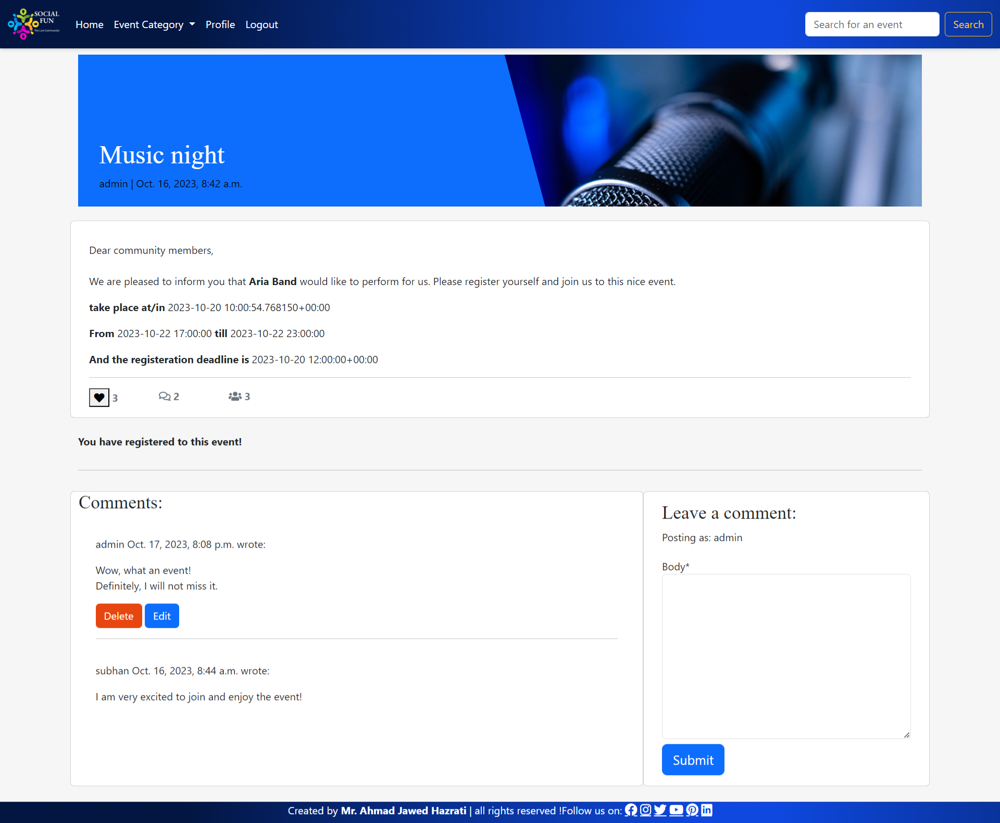<br><br>
- __Event Registeration Page__
  - This page is only visible to authorized user and contains the event details and registeration confirmation button. 
  - The user has also the ability to go back to the event detail page by clicking the back button.
  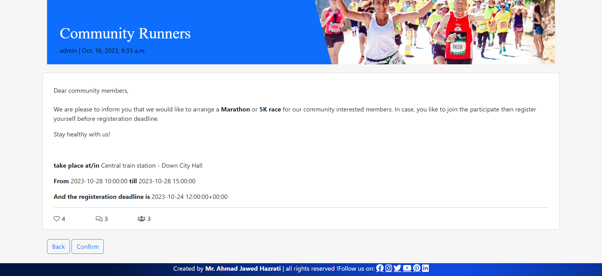<br><br>
- __Category Page__ 
  - The category page is only visible to authorized user and contains the list of all event related to selected category.
  - The category page can be accessed from the navbar dropdown link and is dynamic. The category dropdown updates when a new category is added by the admin.
  - The event in the category page is navigable and prompt the user to the event detail page once selected.
  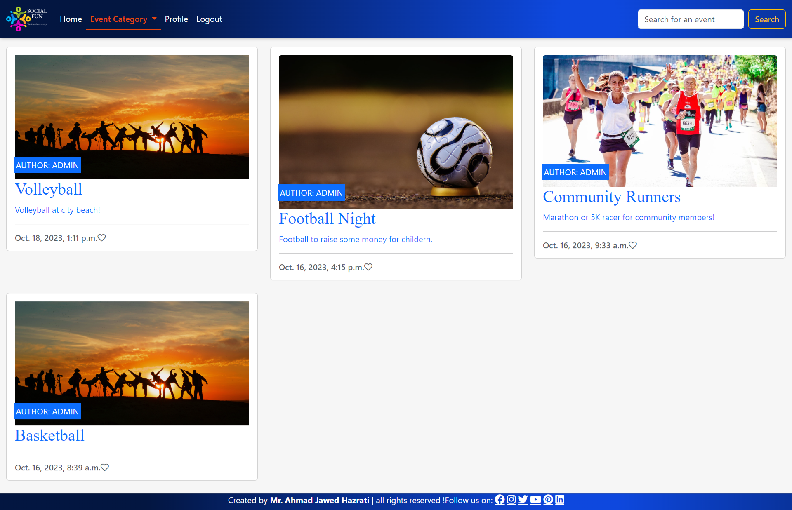<br><br>
- __Profile Page__ 
  - The profile page is only visible to authorized user and comprises of profile properties, an edit button and latest events created by the user.
  - The user can edit its profile avatar and bio in here.
  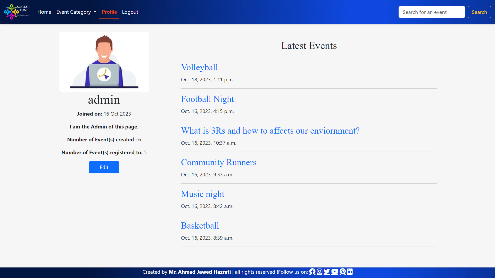<br><br>
- __Logout Page__ 
  - The logout page is only visible to authorized user and allows the user to logout securely from the website.
  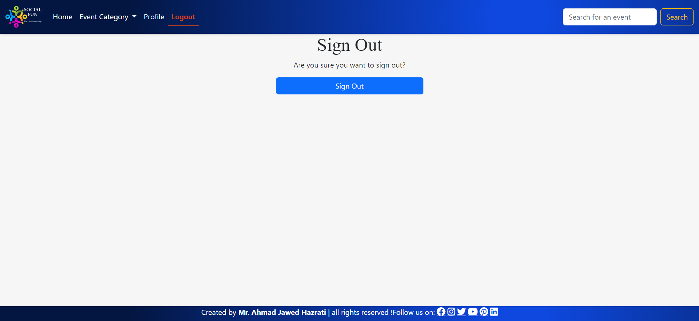<br><br>
- __Register Page__ 
  - The register page is only visible to unauthorized user and allows the user to create an account and securely access the website.
  - The page allows the user to fill out the form and sign up. The page includes a login button to navigate the user to login page in case already has an account.
  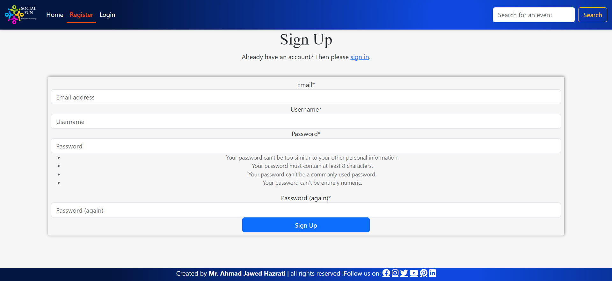<br><br>
- __Login Page__ 
  - The login page is only visible to unauthorized user and allows the user to log in and securely access the website.
  - The page allows the user to fill out his/her username or email and password to log in. The page also comprises a register button to navigate the user to register page in case not have created an account yet.
  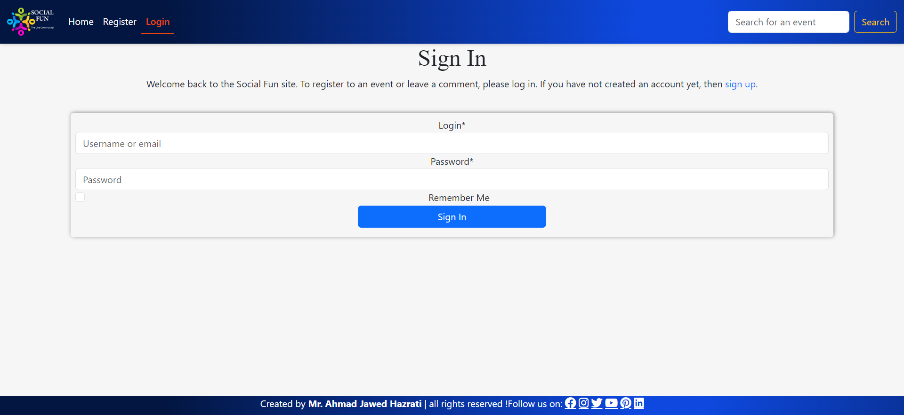<br><br>
- __Builtin Admin Page__ 
  - The builtin admin page is only visible to authorized user and allows the user with admin rights to log in and securely access the website administration panel.
  - The page allows the admin to create, read, update and delete the contents of the event, comment, category and profile pages. 
  <br><br>
- __Base Page__ 
  - This page is the base template that encompases the header and footer, css files, script files, links to external APIs and loads the contents to all other pages when is called.<br><br>

### Features Left to Implement
Initially, the idea was that the venue should be a separate model and user could create, edit and delete venue and event, but due to limited time couldn't implemented.
Further features inclusive (cited above) to implement are:
- another feature couldn't be that user could perform CRUD operations on events and venues from the profile page;
- a review page will be a better feature to be added to the app.
<br><br>
<a href="#contents">BACK TO CONTENTS 🔼</a>

## Technologies Used

### Languages Used
- **Python, JavaScript, HTML and CSS** are used extensively during project.
- **Markdown**: Used exclusively for README.

### Python Packages
- **django**
- **gunicorn**
- **dj-database-url**
- **psycopg2**
- **dj3-cloudinary-storage**
- **whitenoise**
- **jinja2**
- **django-allauth**
- **django-crispy-forms**
- **autopep8**  

### Programs Used
[Bootstrap5](https://getbootstrap.com/): used to add predefined styled elements and responsiveness.<br>
[Git](https://git-scm.com/): used for version control.<br>
[GitHub](https://github.com/): used to host the source code of the program.<br>
[Gitpod](https://gitpod.io/): used to write and test the code.<br>
[Heroku](https://dashboard.heroku.com/): used to deploy the project.<br>
[Cloudinary](https://cloudinary.com/): used to store static files.<br>
[Summernote](https://summernote.org/): used to online editors.<br>
[PostgreSQL](https://www.elephantsql.com/): used to store the website data.<br>
[Balsamiq](https://balsamiq.com/wireframes/): used to sketch the project contents.<br>
[TinyPNG](https://tinypng.com/): used to compress the images.<br>
[Favicon.io](https://favicon.io/): used to generate the website favicon.<br>
[Font Awesome](https://fontawesome.com/): used for creating attractive UX with icons.<br>
[Google Fonts](https://fonts.google.com/): used for project typography.<br>
[JsHint](https://jshint.com/): used to validate the scripts.<br>
[PEP8 Validator](http://pep8online.com/): used to perform check of Python code.<br>
[HTML - W3C HTML Validator](https://validator.w3.org/#validate_by_uri+with_options): used to valid the HTML pages.<br>
[CSS - Jigsaw CSS Validator](https://jigsaw.w3.org/css-validator/#validate_by_uri): used to valid the CSS.<br>
[Chrome Del Tools](https://developer.chrome.com/docs/devtools/): used for project debugging purpose.<br>
[W.A.V.E.](https://wave.webaim.org/): used for testing accessibility.<br>
[Freepik](https://www.freepik.com/): used to generate the website logo.<br>
[Pexels](https://www.pexels.com/): used to generate the website images.<br>
[Gradients](https://gradients.shecodes.io/gradients/398#gradient): used to generate the header and footer gradient color.<br>
**Light House**: used to test the website performance.<br>
<br><a href="#contents">BACK TO CONTENTS 🔼</a>

## Testing 
### Development Testing

- __Starting Options__
  - The app started successfully using the Run Program button with the title formated with art library and font "cybermedium" and with 2 lines text describing the app's purpose. Subsequently followed by the main menu options.
  - Select "Current Weather" or "Forecast Weather", or "Weather Comparison" or "Exit§ option to direct to the relevant section.
    <br><br>
- __Current Weather__
  - The current weather page loaded successfully prompting the user for input. 
  - When the input is correct, the current weather is displayed. 
  - The sub-menu option is presented afterwards with each one working satisfactorily. 
  - Various errors were purposefully entered into the terminal to check the app response as detailed below:
  - *Non-alphabet / letter entry*: a variety of non-letter entries were made with the expected response detailed below: .
    A while loop is run to reprompt the user until enters the valid input.
  - *Invalid City Name*: a number of incorrect city names were typed to test and the response are detailed below: .
   <br><br>
- __Forecast Weather__
  - - The forecast weather page loaded successfully prompting the user for input. 
  - When the input is correct, the forecast weather is displayed. 
  - The sub-menu option is presented afterwards with each one working satisfactorily. 
  - Various errors were purposefully entered into the terminal to check the app response as detailed below:
  - *Non-alphabet / letter entry*: a variety of non-letter entries were made with the expected response detailed below: .
    A while loop is run to reprompt the user until enters the valid input.
  - *Invalid City Name*: a number of incorrect city names were typed to test and the response are detailed below: .
  <br><br>
- __Weather Comparison__
   - The weather comparison page loaded successfully prompting the user for inputs. 
  - When the inputs are correct, the weather information is displayed with the result of compared weather conditions. 
  - The sub-menu option is presented afterwards with each one working satisfactorily. 
  - Various errors were purposefully entered into the terminal to check the app response as detailed below:
  - *Non-alphabet / letter entry*: a variety of non-letter entries were made with the expected response detailed below: .
    A while loop is run to reprompt the user until enters the valid input.
  - *Invalid City Name*: a number of incorrect city names were typed to test and the response are detailed below: .
   <br><br>
- __User Options__
  - The two User Options formats - main menu and and sub-menu - were both presented at the appropriate time: current weather, forecast weather, and weather comparison respectively.
  - Each option was selected to confirm direction to the appropriate part of the app.

### Testing User Stories
#### User Goals
- **To check the current weather of a location / city.**
  - The app prompts the user to enter the name of any geographical location / city to display the current weather condition. 
  - The app then presents the data back to the user, fulfilling the requirements of this user goal.

- **To check the next 5 days weather forecast for any geographical location/ city.**

  - The user is prompted to enter the name of any geographical location / city to display the forecast weather for next 5 days. 
  - The user is then presented with the 5 days forecasts weather, achieving the objective of this goal.

- **To see the weather condition comparison result of 2 different locations/ cities.**

  - The user is prompted to enter the names of any geographical locations / cities to display the weather condition with a compared weather condition result. 
  - The user is then presented with the output, fulfilling this goal.

#### Site Administrator Goals
  - **To give users the options to check current weather, weather forecasts and weather comparison result of 2 different locations / cities from the terminal.**

    - The user can access current weather, forecast weather and weather comparison result data via via Open Weather API.

  - **To give users the ability to navigate through options back and forth easily.**

    - The menu and sub-menu options allows the user to go back and forth and experience different sections of the app.

  - **To present data in more user friendly format as possible within the constraints of the terminal.**

    - The font format, menu options, display data with a break of 1-2 seconds and validating the user inputs are some of the measures in this regard.

    - **To create an application using Python with clean, resuable and commented code, utilising different functions and libraries.**

    - code has been broken into discrete files to try and group together code in an ordered manner that seeks to follow the flow of the program.
    - The code has been broken into discrete files to try and group together code in an ordered manner that seeks to follow the flow of the program.
    - The functions have been written in a way such that they are atomic and perform discrete operations. The fun.py file has many examples of function calls in order to create the end result.
    - Code is commented throughout to provide future proofing and all functions are annotated with a docstring.

  - **To handle any potential errors appropriately and consistently.**

    - Throughout the app there are multiple points where error handling is required. This is achieved through try/except in most cases along with if/else statements. 

  - **To keep security sensitive information hidden.**

    - The Open Weather API key is stored as an environment variable in Heroku project config vars and testing API key added to gitignore file.

### Validator Testing 

- Python
  - Each Python file was passed through the Code Institute Linter. After refactoring, the code was passed through the linter again and the results are shown below.
    - The current_weather.py file was passed through the linter with no warnings or errors returned.
  <br><br> 
     - The forecast_weather.py file was passed through the linter with no warnings or errors returned.
  <br><br> 
    - The weather_comparison.py file was passed through the linter with no warnings or errors returned.
  <br><br> 
    - The run.py file was passed through the linter and few long line warnings returned due to conditional statements being used and couldn't find the desired solution to meet them.
  <br><br>  

<a href="#contents">BACK TO CONTENTS 🔼</a>

### Bugs / Issues

<table  width = 100% cellspacing="0" cellpadding="0">
   <tr>
   <th>Issue/Bug</th>
   <th>Solution</th>
   </tr>
   <tr>
   <td>Issue with simple-terminal-menu library not being supported by WINDOWS.</td>
   <td>Ubantu as virtual machine is installed and used as platform to run the VS Code on and then clone the repository to it.</td>
   </tr>
   <tr>
   <td>Issue with importing the API key.</td>
   <td>Windows environment variable and the function "os.getenv" is used to solve the issue.</td>
   </tr>
   <tr>
   <td>Issue with incorrect user input.</td>
   <td>Add get_user_input function with the use of try and except and if-else conditional statements to solve the issue.</td>
   </tr>
   <tr>
   <td> Tried to deploy to Heroku app but got failed due to requirements.txt file has been populated with template meta data.</td>
   <td>Regenerate the requirements.txt and then run the deployment and the issue is solved.</td>
   </tr>
   <tr>
   <td>Issue to get the weather condition for next 5 days.</td>
   <td>Run the for loop for date list and solve the issue.</td>
   </tr>
  </table>

### Unresolved Bugs or Issues
- The issue to indent the long conditional statements are not met due to not finding required data and insufficient time.
 <br><br>
<a href="#contents">BACK TO CONTENTS 🔼</a>

## Deployment

### Deploying to Heroku
* This site was deployed by completing the following steps:

1. Log in to [Heroku](https://id.heroku.com) or create an account.
2. On the main page click the button labelled New in the top right corner and from the drop-down menu select Create New App.
3. You must enter a unique app name.
4. Next select your region.
5. Click on the Create App button
6. The next page is the project’s Deploy Tab. Click on the Settings Tab and scroll down to Config Vars.
7. Click Reveal Config Vars and enter the following variables and values:
    - Add "PORT" and its value.
    - Add "CLOUDINARY_URL" and its value.
    - Add "DATABASE_URL" and its value.
    - Add "SECRET_KEY" and its value.
8. Next, scroll down to the Buildpack section click Add Buildpack select python and click Save Changes.
9. Repeat step 8 to add node.js. o Note: The Buildpacks must be in the correct order. If not click and drag them to move into the correct order.
10. Scroll to the top of the page and choose the Deploy tab.
11. Select Github as the deployment method.
12. Confirm you want to connect to GitHub.
13. Search for the repository name and click the connect button.
14. Scroll to the bottom of the deploy page and select the preferred deployment type.
15. Click either Enable Automatic Deploys for automatic deployment when you push updates to Github.

### Fork the repository
To create a copy of the repository on your account and change it without affecting the original project, use **Fork** directly from GitHub:
1. On [My Repository Page](https://github.com/Ahmad-Hazrati/django-event), press Fork in the top right of the page
2. A forked version of my project will appear in your repository

### Making a Local Clone

1. Log in to Github and locate the [Github Repository.](https://github.com/Ahmad-Hazrati/django-event)
2. Under the repository name, click "Clone or download".
3. To clone the repository using HTTPS, under "Clone with HTTPS", copy the link.
4. Open Git Bash
5. Change the current working directory to the location where you want the cloned directory to be made.
6. Type `git clone`, and then paste the URL you copied in Step 3.

```
$ git clone https://github.com/YOUR-USERNAME/YOUR-REPOSITORY
```

7. Press Enter. Your local clone will be created.

```
$ git clone https://github.com/YOUR-USERNAME/YOUR-REPOSITORY
> Cloning into `CI-Clone`...
> remote: Counting objects: 10, done.
> remote: Compressing objects: 100% (8/8), done.
> remove: Total 10 (delta 1), reused 10 (delta 1)
> Unpacking objects: 100% (10/10), done.
```
<br><br>
<a href="#contents">BACK TO CONTENTS 🔼</a>

## Credits 
### Content 
- The idea of the project and most of the contents were taken from P4 walkthrough project. 
- The other contents are fictitious.

### Media
- The site logo image is taken from the [Freepik](https://www.freepik.com/) and the other site images are taken from [Pexels](https://www.pexels.com/).

### Code
- The code used for most parts of the website is taken from the [Django Blog Webinar](https://www.youtube.com/watch?v=YH--VobIA8c).
- The code to add pagination and search functionality to the app are taken from [Codemy's tutorial](https://www.youtube.com/watch?v=HHx3tTQWUx0&list=PLCC34OHNcOtqW9BJmgQPPzUpJ8hl49AGy).
- The code used for event registeration is taken from [Dennis Ivy's Github](https://github.com/divanov11/codebattles.dev).
- The code to create the profile page is taken from [Dee-McG's tutorial](https://github.com/Dee-McG/Recipe-Tutorial/tree/main).
- The code used to create the category page is written with the support of mentor.

## Acknowledgements
- Thanks to my Code Institute mentor Mr. Aleksei Konovalov for his guidance, insight, and constant confidence boost to help me in the right direction.
- Thanks to Code Institute for material and support (Tutor Assistance), Slack Community, and other valuable online resources.
<br><br>
<a href="#contents">BACK TO CONTENTS 🔼</a>